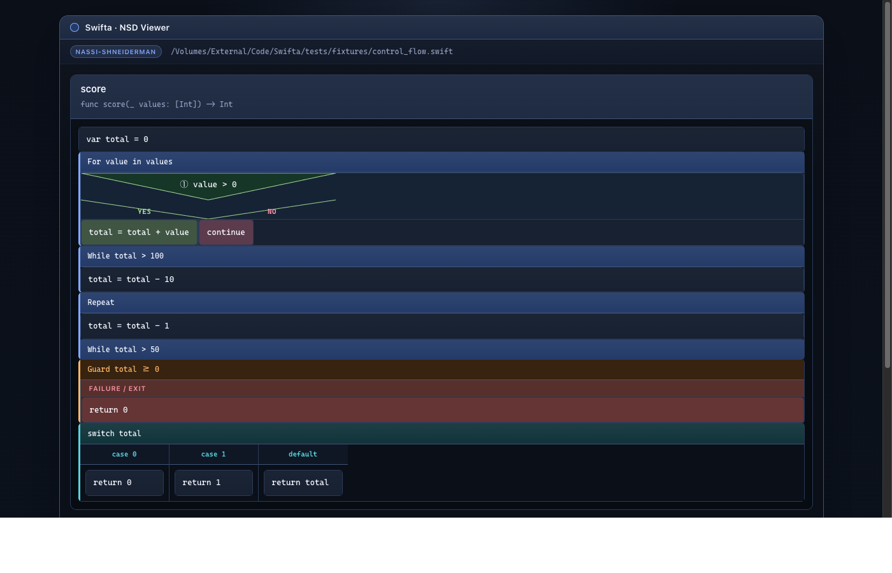
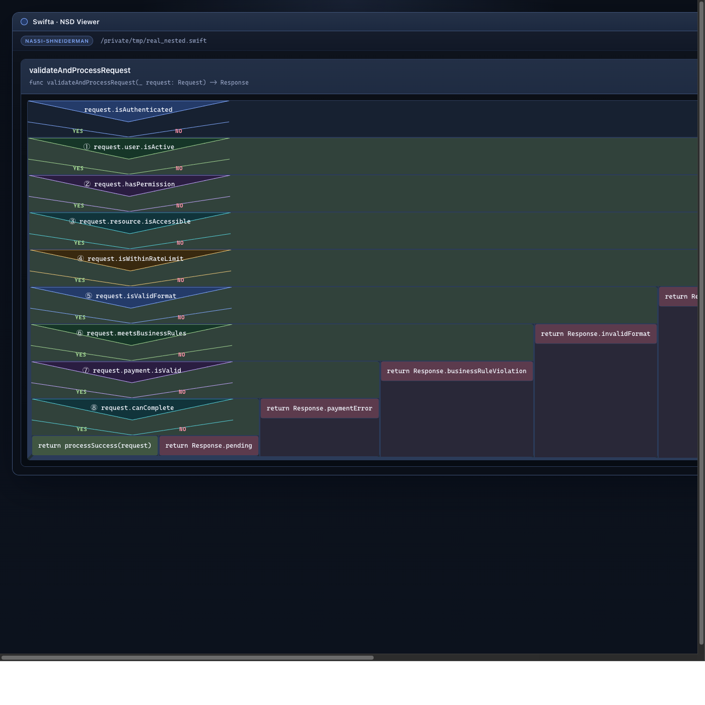

# Swifta

Swifta is a simple, scalable monolith for parsing Swift source code through ANTLR while keeping the architecture clean enough for future semantic analysis, indexing, and export pipelines.

The project starts from the domain, not from the framework:

* business goal: convert Swift source into a stable structural model for downstream tooling
* architectural style: DDD-inspired layered monolith with hexagonal boundaries
* parser engine: ANTLR4 with the public Swift 5 grammar from `antlr/grammars-v4`, plus a reproducible Python-compatibility patch step
* current delivery channel: CLI that parses a file or a directory and returns versioned JSON

## What the system does

Today the system supports:

* **Parsing Swift code**
  * parsing one Swift file
  * parsing a directory of Swift files
  * extracting a lightweight structural model: imports, type declarations, functions, variables, and extensions
  * reporting syntax diagnostics as part of the contract

* **Control flow extraction**
  * if/else statements with nested branches
  * guard statements
  * while loops
  * for-in loops
  * repeat-while loops
  * switch/case statements
  * do-catch blocks
  * defer blocks
  * trailing closure expansion (`.map{}`, `.forEach{}`, `.reduce{}`)

* **Nassi-Shneiderman diagrams**
  * building a Nassi-Shneiderman HTML diagram for one Swift file
  * building diagram bundles for entire directories with index page
  * classic NS rendering with SVG triangles for if-blocks
  * depth-coded nested ifs (up to 50 levels with color cycling and Unicode badges ①-㊿)
  * classic case block structure with side-by-side columns
  * dark Tokyo Night-inspired theme with JetBrains Mono font
  * proper text wrapping and responsive layout

* **Architecture**
  * keeping parser infrastructure behind ports so the application layer stays independent from ANTLR, filesystem, and CLI details

## Diagram Features

The Nassi-Shneiderman diagrams include:

* **Visual clarity**
  * Classic NS triangles for if-blocks with Yes/No labels
  * Horizontal dividers for case blocks with side-by-side columns
  * Color-coded block types (loops=blue, guards=orange, switches=teal, etc.)
  * JetBrains Mono monospace font for code readability

* **Depth awareness**
  * 50 depth levels with cycling colors (blue → green → purple → teal → amber)
  * Unicode circled badges (①-⑩, ⑪-⑳, ㉑-㉟, ㊱-㊿) on nested conditionals
  * Background tinting for deeper nesting levels

* **Dark theme**
  * Tokyo Night-inspired color palette optimized for code readability
  * Proper contrast ratios for comfortable viewing
  - Responsive layout for different screen sizes

* **Smart parsing**
  * Trailing closure expansion for functional chains
  * Autoreleasepool unwrapping for Objective-C interop
  * Fast path for simple function bodies

### Screenshots

**Basic control flow** — loops, guards, and switch/case blocks:



**Nested conditionals** — depth-coded badges and colors for up to 50 nesting levels:



## Architecture

The codebase is split into four explicit layers:

* `domain`: domain model, invariants, ports, and domain events
* `application`: use cases and DTOs
* `infrastructure`: ANTLR adapter, filesystem adapters, event publishing
* `presentation`: CLI contract

See the full design docs in [docs/domain-and-goals.md](/Volumes/External/Code/Swifta/docs/domain-and-goals.md), [docs/requirements.md](/Volumes/External/Code/Swifta/docs/requirements.md), [docs/system-context.md](/Volumes/External/Code/Swifta/docs/system-context.md), [docs/glossary.md](/Volumes/External/Code/Swifta/docs/glossary.md), and [docs/architecture.md](/Volumes/External/Code/Swifta/docs/architecture.md).

## Quick Start

1. Install dependencies:

```bash
uv sync --extra dev
```

2. Generate the Swift parser from the vendored grammar:

```bash
uv run python scripts/generate_swift_parser.py
```

3. Parse a single file:

```bash
uv run swifta parse-file path/to/File.swift
```

4. Parse a directory:

```bash
uv run swifta parse-dir path/to/project
```

5. Build a Nassi-Shneiderman diagram for a Swift file:

```bash
uv run swifta nassi-file path/to/Algorithms.swift --out output/algorithms.nassi.html
```

6. Build Nassi-Shneiderman diagrams for an entire directory:

```bash
uv run swifta nassi-dir path/to/project --out output/nassi-bundle
```

## Constraints and honesty

The current ANTLR grammar is sourced from `antlr/grammars-v4/swift/swift5`. Its own README states that it targets Swift 5.4 syntax, is not fully aligned with the Swift compiler, and has known ambiguities. The upstream grammar also needs a compatibility patch step for Python target generation because the original grammar ships with Java-oriented support code and embedded actions. Swifta makes those limitations explicit in requirements, ADRs, and runtime metadata so downstream consumers know what contract they are integrating with.

## Next Steps

Useful future extensions:

* richer control flow visualization (async/await, actors, SwiftUI)
* symbol graph export
* semantic passes on top of the structural model
* integration adapters for external analysis tools
* incremental parsing and caching
* interactive HTML diagrams with collapsible nodes
* export to other diagram formats (SVG, PNG, Mermaid)
